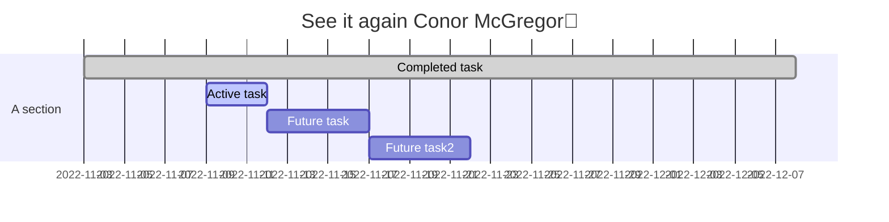
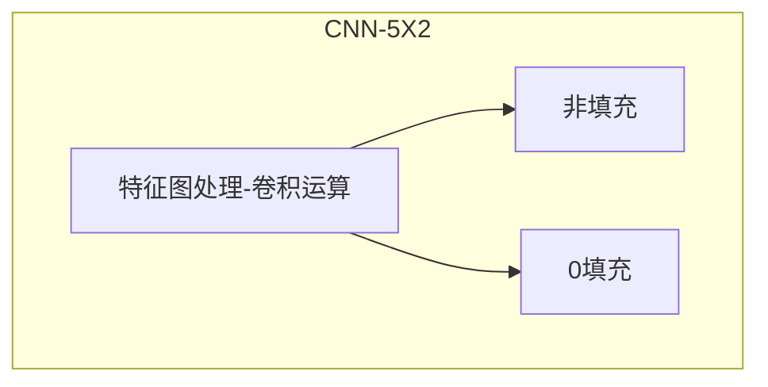

|bingo|非填充|0填充|
|---|---|---|
|图像模糊|
|图像锐化|
|边缘检测|
|Sobel|
|Prewitt|
|Laplace|
* 4种数据预处理方法 (axis=0 列，axis=1 行)
	* 中心化 Y=X-aver;xi-x-
	* 自标度化 Y=(x-aver)/std
	* 标准化
		* 色谱面积最大化 xi=xi/sum.xi
		> Y=X.T S=Y.sum (axis=0) Y=Y/S Y=Y.T
		* 质谱最大归一化 xi=xi/max.x
		> Y=X.T max=Y.max (axis=0) Y=Y/max Y=Y.T
	 	
	 	

Formulas

  
  

